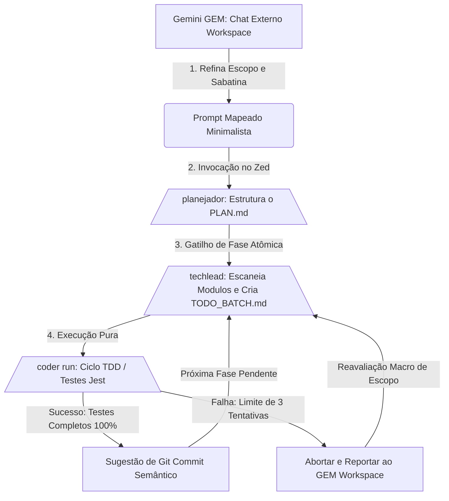

# Zed Agents Blueprint

Este repositório centraliza o modelo de arquitetura, as diretrizes de prompt para agentes locais do editor Zed e a esteira de automação híbrida para múltiplos projetos. O objetivo principal é mitigar a alucinação de código e evitar a divergência de configurações (Configuration Drift) entre diferentes repositórios.

---

## Propósito do Repositório

Quando trabalhamos com agentes autônomos locais (Planejador, Techlead e Coder), é essencial manter as regras comportamentais de cada skill idênticas e isoladas da lógica de negócios mutável de cada projeto. 

Este repositório serve como a fonte da verdade de engenharia, fornecendo:
* As instruções de sistema (System Prompts) para as 3 skills locais do Zed.
* A configuração universal do GEM (Gemini Workspace) para refinamento e comitê de crise.
* Templates padronizados e enxutos do arquivo AGENTS.md para novos projetos.
* Um script de automação para injetar o ecossistema em qualquer novo repositório em um segundo.

---

## Fluxo de Trabalho (Flowchart)

O repositório opera sob o princípio de ciclos atômicos e fatiamento rigoroso por fases (uma fase por vez). Abaixo está a representação visual de como a inteligência externa interage com os agentes locais do editor:



---

## Instalação e Configuração

Para iniciar o ecossistema de agentes em um novo projeto, você não precisa copiar os arquivos manualmente. Utilize o script de instalação automática.

### Passo 1: Clonar o Blueprint Central
Clone este repositório em uma pasta dedicada na sua máquina de desenvolvimento:
```bash
git clone [https://github.com/seu-usuario/zed-agents-blueprint.git](https://github.com/seu-usuario/zed-agents-blueprint.git) ~/zed-agents-blueprint
```

### Passo 2: Executar o Script de Injeção
Navegue até a pasta raiz do seu novo projeto de software e execute o script apontando para o caminho do blueprint clonado:
```bash
cd ~/caminho/do/seu-novo-projeto
chmod +x ~/zed-agents-blueprint/install.sh
~/zed-agents-blueprint/install.sh
```

### O que este script faz?
1. Copia o arquivo `WORKFLOW.md` atualizado para a raiz do seu projeto novo, servindo como guia local.
2. Verifica se o projeto já possui um arquivo `AGENTS.md`. Se não houver, ele injeta o template padrão enxuto na raiz para que você preencha apenas as variáveis específicas da sua stack (gerenciador, arquitetura e proibições).

### Passo 3: Configurar as Skills no Zed
Abra as configurações de IA do seu editor Zed e crie as 3 skills locais (`planejador`, `techlead`, `coder`) utilizando como instrução o conteúdo dos arquivos markdown salvos na pasta `/skills` deste blueprint.
```
